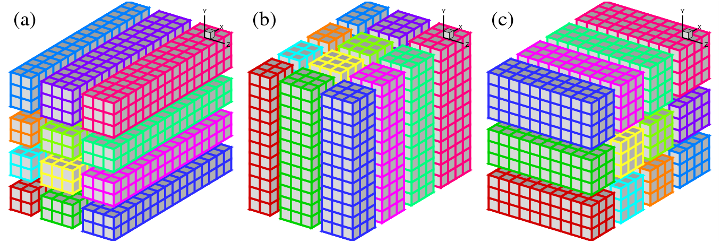
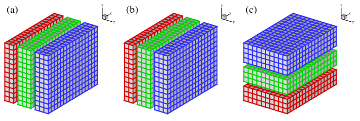
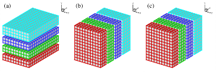

## Using the 1D Decomposition Mode

While 2DECOMP&FFT implements a general-purpose 2D pencil decomposition library, 1D slab decomposition remains an attractive option for certain applications.

- For small-to-medium size applications, which are unlikely to hit the constraint imposed by the decomposition strategy, having simpler and more efficient implementations is often preferable.
- There are applications with algorithms that can not be easily split to multiple 1D operations (for example a Poisson solver using 1D FFT in a homogeneous direction and a 2D multigrid solver in the two remaining directions).
- For applications with multiple levels of parallelism, it may be more convenient to use 1D decomposition for the coarse-grain level data distribution. Then on each slab fine-grain parallelism can be applied (e.g. using OpenMP on shared-memory node).

   
  Figure 1: 2D domain decomposition example using a Prow*Pcol=4*3 processor grid: (a) X-pencil; (b) Y-pencil; (c) Z-pencil.

Fig.1 shows an arbitrary 3D domain partitioned using a 2D processor grid of Prow=4 by Pcol=3. Clearly 1D decomposition is just a special case of 2D decomposition with either Prow=1 or Pcol=1. In both cases, the communication algorithms can be simplified significantly.

  
   
  Figure 2: 1D slab decomposition of the same domain as in Figure 1  Left: Prow=1; Right: Pcol=1.

If Prow=1, state (a) and (b) are identical, as shown in Fig.2 (left); similarly, for Pcol=1, state (b) and (c) are identical, shown in Fig.2 (right). So the 1D decomposition can be defined as either slabs in Y and Z or slabs in X and Y. The former is often preferred as better cache efficiency may be achieved by always keeping the X direction in local memory.

When using the 2DECOMP&FFT library with 1D decomposition, half of the global transpositions can be dropped, resulting in more efficient code. This optimisation was introduced in version 1.1 of 2DECOMP&FFT.

Finally, note that one can also rely on this arrangement to perform large distributed 2D simulations. For example one option is to define the 2D data sets in an X-Y plane by setting nz=1 and Pcol=1 (arrays are still to be declared as 3D to satisfy the programming interface of the library).