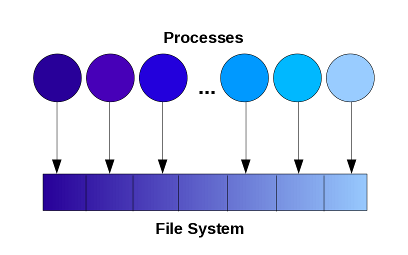
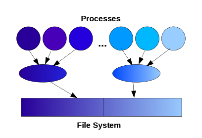

## Parallel I/O API

For large-scale applications using thousands of processors, doing proper I/O is often as important as having efficient parallel algorithms. 2DECOMP&FFT provides a parallel I/O module to help applications handle large data set in parallel. This module takes advantage of the decomposition information available in the library kernel and uses MPI-IO to implement some most frequently used I/O functions for applications based on 3D Cartesian data structures.

All the I/O functions have been packed in a Fortran module:
```
      use decomp_2d_io
```

#### To write a single three-dimensional array to a file

```
      call decomp_2d_write_one(ipencil,var,filename)
```
where `ipencil` describes how the data is distributed (valid values are: 1 for X-pencil; 2 for Y-pencil and 3 for Z-pencil); `var` is the reference to the data array, which can be either real or complex; `filename` is the name of the file to be written. A more general form of the subroutine is:
```
      call decomp_2d_write_one(ipencil,var,filename, opt_decomp)
```
where the global size of the data array is described by the decomposition object `opt_decomp` (as discussed in the [Advanced 2D Decomposition API](api_decomposition.md)), allowing distributed array of arbitrary size to be written. The file written would contain the 3D array in its natural i,j,k-order so that it can be easily processed (for example by a serial post-processing code). A corresponding *read* routine is also available.

#### To write multiple three-dimensional variables into a file

This function is very useful when creating check-point files or result files. It is in the form of:
```
      call decomp_2d_write_var(fh,disp,ipencil,var)
```
where `fh` is a MPI-IO file handle provided by the application (file opened using `MPI_FILE_OPEN`); `ipencil` describes the distribution of the input data (valid values are: 1 for X-pencil; 2 for Y-pencil and 3 for Z-pencil); `disp` (meaning displacement) is a variable of kind `MPI_OFFSET_KIND` and of intent INOUT - it is like a pointer or file cursor tracking the location where the next chunk of data would be written in the file. It is assumed that the data array is in the default global size, otherwise the function also takes a second and more general form:
```
      call decomp_2d_write_var(fh,disp,ipencil,var,opt_decomp)
```
where the decomposition object `opt_decomp` describes the arbitrary size of the global dataset.

To create a restart/checkpointing file, it is often necessary to save key scalar variables as well. This can be done using:
```
      call decomp_2d_write_scalar(fh,disp,n,var)
```
where `var` is an 1D array containing `n` scalars of the same data type. The supported data types are: *real*, *complex* and *integer*.

These subroutines have corresponding *read* routines with exactly the same set of parameters. Applications are responsible for closing the file after everything is written (calling `MPI_FILE_CLOSE`). Again, each chunk of data in the file contains one variable stored in its natural order. One major benefit is that it becomes very easy to read the data back into the application using a different number of MPI processes.

#### To write a 2D slice of data from a 3D variable

```
      call decomp_2d_write_plane(ipencil,var,iplane,n,filename,opt_decomp)
```
where `ipencil` describes the distribution of the 3D variable var; iplane defines the direction of the desired 2D slice (1 for X-plane; 2 for Y-plane and 3 for Z-plane); `n` specifies which plane to write out (in the global coordinate system); and `filename` is the name of the file to be written. As before, `opt_decomp` is an optional argument that can be used when `var` is of non-default size.

#### To write out a 3D variable in lower resolution to a file

Applications using the 2D decomposition often handle quite large data sets. It may not be practical to write out everything for post-processing. The following subroutine provide a convenient way to write only a subset of the data for analysis.

```
      call decomp_2d_write_every(ipencil,var,iskip,jskip,kskip,filename,from1)
```
where once again `ipencil` describes the distribution of the 3D variable `var`, and `filename` defines the name of the file to be written. Every `iskip`-th points of the data in X-direction, `jskip`-th in Y-direction and `kskip`-th in Z-direction are to be written. Finally `from1` is a boolean flag. Assuming every n-th data points are to be written out, the data points have indices of:

- 1,n+1,2n+1... if `from1` is `.true.`
- n,2n,3n... of `from1` is `.false`.

#### Quick I/O Reference

The following table summarises the supported I/O types and data types of the subroutines:

<table>
	<tr style="background-color:#09548B; color:#ffffff;">
	  <td align="center">IO functions</td>
	  <td colspan="2" align="center">I/O type</td>
	  <td colspan="3" align="center">Data type</td>
	  <td align="center">decomp<sup>#</sup></td>
	</tr>
	<tr class="alt">
	  <td align="center" width="25%">&nbsp;</td>
	  <td align="center" width="12%">Read</td>
	  <td align="center" width="12%">Write</td>
	  <td align="center" width="12%">Real</td>
	  <td align="center" width="12%">Cmplx</td>
	  <td align="center" width="12%">Int</td>
	  <td align="center" width="15%">&nbsp;</td>
	</tr>
	<tr>
	  <td align="center">_one</td>
	  <td align="center"></td>
	  <td align="center"></td>
	  <td align="center"></td>
	  <td align="center"></td>
	  <td align="center">&nbsp;</td>
	  <td align="center"></td>
	</tr>
	<tr class="alt">
	  <td align="center">_var</td>
	  <td align="center"></td>
	  <td align="center"></td>
	  <td align="center"></td>
	  <td align="center"></td>
	  <td align="center">&nbsp;</td>
	  <td align="center"></td>
	</tr>
	<tr>
	  <td align="center">_scalar</td>
	  <td align="center"></td>
	  <td align="center"></td>
	  <td align="center"></td>
	  <td align="center"></td>
	  <td align="center"></td>
	  <td align="center">N/A</td>
	</tr>
	<tr class="alt">
	  <td align="center">_plane</td>
	  <td align="center">&nbsp;</td>
	  <td align="center"></td>
	  <td align="center"></td>
	  <td align="center"></td>
	  <td align="center">&nbsp;</td>
	  <td align="center"></td>
	</tr>
	<tr>
	  <td align="center">_every</td>
	  <td align="center">&nbsp;</td>
	  <td align="center"></td>
	  <td align="center"></td>
	  <td align="center"></td>
	  <td align="center">&nbsp;</td>
	  <td align="center">&nbsp;</td>
	</tr>
</table>

\# decomp: refers to a decomposition object that describes an arbitrary-size global dataset.

#### Future Development

As these I/O operations are built upon data structured well defined by the decomposition library, it is fairly easy to introduce additional functions, should any need arises.

The I/O library is currently implemented using a straight-forward I/O model - all MPI processes collectively read/write individual files. Depending on hardware situations (in particular the file system), this model may fail to scale above several thousands of processes. A more scalable I/O model, known as *multiple writers* model, is to use a subset of processes serving as local master, each processing data on behalf on a group of processes. This feature will be introduced in a future version of the library when there are clear practical requirements.

<p align="center">
    
	<br>
	Sketches of two I/O models.
</p>

#### I/O Optimisation for LUSTRE File System

<p style="color:red;">[This section covers a very specific optimisation that worked well on certain production systems 10+ years ago. The validity of this technique needs to be accessed carefully on modern systems.]</p>

LUSTRE is a widely used distributed file system. On LUSTRE, files are 'striped' across multiple object storage targets (physical disks) that can be accessed in parallel to acheive high performance. Naturally, the best striping strategy is dependent on hardware configurations and software parameters (such as file sizes). [T3PIO](https://github.com/TACC/t3pio) is a library that allows applications to programmatically set the optimal LUSTRE parameters when writing files via MPI-IO or HDF5. It has potential to significantly improve I/O performance.

From version 1.5, 2DECOMP&FFT can optionally use T3PIO to optimise its parallel IO routines. To use this feature, first make sure that you are using LUSTRE file system and T3PIO library is available on your system, then use the **-DT3PIO** flag to turn on T3PIO support while building 2DECOMP&FFT. In one set of benchmarks, when writing a 8GB file collectively from 1024 cores on a busy production Cray XE6 system, a speed-up of 3 times was achieved.