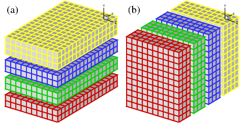

## Domain Decomposition Strategies

The discussions here apply to many applications based on three-dimensional Cartesian meshes (or to be exact, having a Cartesian topology), and in particular those using spatially implicit numerical schemes. For example, a compact finite difference scheme often results in solving a tridiagonal linear system when evaluating spatial derivatives or doing spatial interpolations; a spectral code often involves performing a Fast Fourier Transform along a global mesh line.

There are two approaches to performing such computations on distributed-memory systems. One can either develop distributed algorithms (such as a parallel tridiagonal solver or a parallel FFT algorithm working on distributed data), or one can at runtime redistribute (transpose) data among processors in order to apply serial algorithms in local memory. The second approach is often preferred due to its simplicity: existing serial algorithms (hopefully already optimised for a single CPU) remain unchanged; porting serial code can be straight-forward as much of the original code logic still holds, and the only major addition is the data transposition procedures.

#### 1D Slab Decomposition

In early days, many applications implemented the above idea using 1D domain decomposition (also known as slab decomposition). In Fig.1, a 3D domain is arbitrarily chosen to be decomposed in Y and X directions. It can be seen that in state (a), any computations in the X-Z planes can be done in local memories while data along a Y mesh-line is distributed. When it is necessary to calculate along Y mesh-lines (say to evaluate Y-derivatives, or to perform 1D FFTs along Y), one can redistribute the data among processors to reach state (b), in which any computation in Y becomes 'local'. If using standard MPI library, switching between state (a) and (b) can be achieved using the MPI_ALLTOALL(V) routines.

   
  Figure 1. 1D domain decomposition example using 4 processors: (a) decomposed in Y direction; (b) decomposed in X direction.

A 1D decomposition, while quite simple, has some limitations, especially for large-scale applications. Given a cubic mesh of size N^3 , one obvious constraint is that the maximum number of processors Nproc that can be used in a 1D decomposition is N as each slab has to contain at least one plane of data. For a cubic mesh with 1 billion points (which is very large but becomes increasingly common in CFD applications, such as those for fundamental turbulence studies), the constraint is Nproc<=1000. This is a serious limitation as most supercomputers today have at least tens of thousands of cores. Large applications are also likely to hit the memory limit when each processor handles too much workload.

#### 2D Pencil Decomposition

A 2D pencil decomposition (also known as a 'drawer' or 'block' decomposition) is a natural extension to 1D decompositions. Fig.2 shows that the same 3D domain as in Fig.1 can be partitioned in two dimensions. States (a), (b) and (c) are referred to as X-pencil, Y-pencil and Z-pencil arrangements, respectively. While a 1D decomposition algorithm swaps between two states, in a 2D decomposition one needs to traverse 3 different states using 4 global transpositions ((a) =>(b) => (c) => (b) => (a)).

   
  Figure 2: 2D domain decomposition example using a 4*3 processor grid: (a) X-pencil; (b) Y-pencil; (c) Z-pencil.

An interactive view of the 2D pencil decomposition can be found from this [web application](https://monet.nag.co.uk/2decomp/decomp_map.php).

Again MPI_ALLTOALL(V) can be used to realise the transpositions. However it is significantly more complex than the 1D case. There are two separate communicator groups. For a Prow*Pcol processor grid: Prow groups of Pcol processors need to exchange data among themselves for (a) <=> (b) ; Pcol groups of Prow processors need to exchange data among themselves for (b) <=> (c). For example, the red, green and blue processes in state (b) and (c) occupy exactly the same physical domain.

On one hand, the proper implementation of the communication routines can be quite tricky. For example the communications are very sensitive to the orientations of pencils and their associated memory patterns. The packing and unpacking of memory buffers for the MPI library calls must be handled with great care for efficiency. These are pure software engineering topics, which are almost certainly irrelevant to the scientific researches conducted by the applications.

On the other hand, although the idea of 2D decomposition has long been established, its adoption in real applications was not essential until recently, when ordinary researchers can realistically expect to regularly use thousands of cores on major supercomputers, therefore hitting the limitation imposed by 1D decomposition.

These motivated the author to create the 2DECOMP&FFT library - a general-purpose domain decomposition library that can be reused by many applications - to handle these technical issues properly and to hide most software-engineering details from application developers who can concentrate on their scientific studies.

