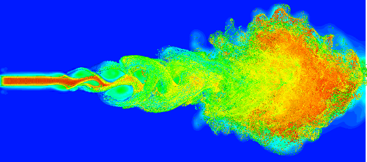

## DSTAR - Direct Simulation of Turbulence And Reaction

DSTAR is a high-order code for **D**irect **S**imulation of **T**urbulence **A**nd **R**eaction, initially developed by Professor Kai Luo (Southampton University) and extended by co-workers over the past 20 years. It solves the complete Navier-Stokes equations as well as conservation equations for energy and chemical species. Modules for both direct numerical simulation (DNS) and large eddy simulation (LES) have been developed for high-fidelity simulation of turbulence, aeroacoustics, turbulent combustion, multiphase turbulent flow and combustion. DSTAR incorporates highly accurate numerical techniques such as 6th-order spatial discretisation, non-reflecting boundary conditions and low-storage Runge-Kutta explicit time-advancement.

Parallel algorithms include MPI and mixed MPI/OpenMP. Parallel operations can be performed in 1D or 2D decomposition as supported by the 2DECOMP&FFT library. In this case, only the decomposition API is required. The code solves the fluid problem in compressible form and there is no tricky Poisson problem involved. The code was ran successfully using 6144 cores in pure MPI mode and 18432 cores in hybrid mode on HECToR.

A typical scientific application is shown below:

   
  Large eddy simulation of a turbulent diffusion flame interacting with evaporating water droplets.
  

The mathematical framework of DSTAR is described in details in:

- K. H. Luo, "Combustion effects on turbulence in a partially premixed supersonic diffusion flame", *Combustion and Flame*, vol. 119(4):417-435, 1999.
- J. Xia, K. H. Luo and S. Kumar, "Large-Eddy Simulation of Interactions Between a Reacting Jet and Evaporating Droplets", *Flow Turbulence and Combustion*, vol. 80(1):133-153, 2008.
- J. Xia and K. H. Luo, "Conditional statistics of inert droplet effects on turbulent combustion in reacting mixing layers", *Combustion Theory and Modelling*, vol. 13(5):901-920, 2009.

Details of the parallelisation was reported at the 2011 Cray User Group conference.

- L. Anton, N. Li and K. H. Luo, "A study of scalability performance for hybrid mode computation and asynchronous MPI transpose operation in DSTAR", *Cray User Group 2011 conference*, Fairbanks, 2011. [PDF](papers/09C-Anton-Paper.pdf)