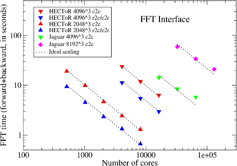

## Benchmarks on HECToR

**These benchmarks were performed a long time ago in early 2010's. Please take this into account when interpreting these results and making comparisons to the more modern supercomputers.**

[HECToR](http://www.hector.ac.uk/) was the UK's front-line national supercomputing service between 2008 and 2014. The system started its phase 1 service as a 60 TFLOPs Cray XT4 system with 5664 AMD Opteron dual-core processors and the SeaStar2 interconnect. In summer 2009, it was upgraded to phase 2a, with AMD Opteron quad-core processors (208 TFLOPs). In late 2010, it underwent major upgrade again to phase 2b - using 1856 nodes (each containing two 12-core AMD Opteron processors) and the Gemini interconnect, making it world's first production Cray XE6 system (374 TFLOPs). The final phase 3 system was a 800 TFLOPs XE6 with 2816 32-core nodes.

#### Small-scale Tests

The performance of a distributed FFT library is determined by both the computation efficiency of the underlying 1D FFT algorithm and the communication efficiency of the data transposition algorithm. The following table shows the speed-up this library can achieve over the serial runs using FFTW's 3D FFT interface. The times reported (on HECToR phase 2a hardware) are for forward c2c transforms and all the transforms were planned using FFTW_ESTIMATE.

<table style="margin-left: auto; margin-right: auto;">
	<tr style="background-color:#09548B; color:#ffffff;">
	  <td style="text-align:center;">Data size N3</td>
	  <td style="text-align:center;" colspan=2>Serial FFTW</td>
	  <td style="text-align:center;" colspan=3>Parallel 2DECOMP&amp;FFT</td>
	</tr>
	<tr>
	  <td style="text-align:center;">&nbsp;</td>
	  <td style="text-align:center;">Planning</td>
	  <td style="text-align:center;">Execution</td>
	  <td style="text-align:center;">16 cores</td>
	  <td style="text-align:center;">64 cores</td>
	  <td style="text-align:center;">256 cores</td>
	</tr>
	<tr style="background-color:#f0f8ff;">
	  <td style="text-align:center;">643</td>
	  <td style="text-align:center;">0.359</td>
	  <td style="text-align:center;">0.00509</td>
	  <td style="text-align:center;">0.00222</td>
	  <td style="text-align:center;">-</td>
	  <td style="text-align:center;">-</td>
	</tr>
	<tr>
	  <td style="text-align:center;">1283</td>
	  <td style="text-align:center;">1.98</td>
	  <td style="text-align:center;">0.0525</td>
	  <td style="text-align:center;">0.0223</td>
	  <td style="text-align:center;">0.00576</td>
	  <td style="text-align:center;">0.00397</td>
	</tr>
	<tr style="background-color:#f0f8ff;">
	  <td style="text-align:center;">2563</td>
	  <td style="text-align:center;">8.03</td>
	  <td style="text-align:center;">0.551</td>
	  <td style="text-align:center;">0.179</td>
	  <td style="text-align:center;">0.0505</td>
	  <td style="text-align:center;">0.0138</td>
	</tr>
	<tr>
	  <td style="text-align:center;">5123</td>
	  <td style="text-align:center;">37.5</td>
	  <td style="text-align:center;">5.38</td>
	  <td style="text-align:center;">1.74</td>
	  <td style="text-align:center;">0.536</td>
	  <td style="text-align:center;">0.249</td>
	</tr>
	<tr style="background-color:#f0f8ff;">
	  <td style="text-align:center;">10243</td>
	  <td style="text-align:center;">-</td>
	  <td style="text-align:center;">-</td>
	  <td style="text-align:center;">-</td>
	  <td style="text-align:center;">4.59</td>
	  <td style="text-align:center;">1.27</td>
	</tr>
	<tr>
	  <td style="text-align:center;">20483</td>
	  <td style="text-align:center;">-</td>
	  <td style="text-align:center;">-</td>
	  <td style="text-align:center;">-</td>
	  <td style="text-align:center;">-</td>
	  <td style="text-align:center;">17.9</td>
	</tr>
</table>

It can be seen that due to the set-up overhead and communication cost, the absolute speed-up over the serial library is not great (only about 20-40 times on 256 cores). However, the parallel library does allow much larger problems to be computed quite efficiently. In particular, for smaller core count (16 and 64), each time the problem size is increased by 8 times, the computing time increases by 8-10 times, following the trend of the underlying serial library very well.

#### 2DECOMP&FFT Scaling on Phase 2a System

This set of benchmarks was performed in March 2010 on the HECToR phase 2a system. A small number of runs were also performed on Jaguar<a href="#note1" id="note1ref">1</a> - the world No. 1 system at that time - for reference.

Large-scale parallel benchmarks of the FFT interface were performed, using problem size up to 8192^3. The results presented are the time spent to compute a pair of forward and backward transforms on random signals. Both c2c and r2c/c2r transforms were tested. The underlying FFT engine is the ACML FFT (version 4.3). In all cases, the original signals were recovered to machine accuracy after the backward transforms - a good validation for the library. Up to 16384 cores were used on HECToR and each case was repeated 3 times and the fastest results were recorded. On Jaguar, a few very large tests were arranged using up to 131072 cores. Note that the runtime performance does vary a lot for such communication intensive applications, particularly on busy production systems.

   
  Scaling of the FFT interface on HECToR phase 2a and Jaguar.

It can be seen that the FFT interface scales almost perfectly on HECToR for all the tests. As expected, r2c/c2r transforms are twice as fast as c2c transforms. On Jaguar, the scaling is less good for larger core counts but the paralle efficiency is still at a respectable 81% for the largest test. For a particular configuration - 4096^3 mesh on 16384 cores - the time spent on Jaguar is almost twice of that on HECToR. This is not unexpected. Jaguar had two 6-core chips. In order to achieve better load balance, the problem sizes need to have a factor of 6 which was not the case in these tests. Also the problem size 8192^3, while quite large for real-world applications, is indeed too small when distributing over 10^5 cores.

#### Scaling of the Share-memory Implementation

Please refer to [this document](shared_memory.md).

#### Stretching HECToR to the Limit

In April 2011, one of my collaborators in China (who at that time was lucky enough to have access to the whole Tianhe-1A system there for his research) asked me to perform some reference FFT computations on really large problem sizes, such as 12288\*12288\*12288 and 14336\*14336\*7168.

The largest tests done before was on problem size 8192^3, but on either much larger systems (such as Jaguar) or on systems with lots of memory. Memory per core on HECToR has decreased from the initial 3 GB to only 1.33 GB with the arrival of 24-core nodes, making it much more difficult to run larger tests.

The library code had to be optimised first to minimise the memory footprint. The ACML implementation of the library was optimised by using inplace transforms wherever possible. A software option was also introduced to allow the FFT input to be overwritten.<a href="#note2" id="note2ref">2</a> In order to increase the problem size further, the 24-core nodes can be under-populated - by using only 16 cores per node, each core will have access to about 50% more memory.

<table>
	<tr style="background-color:#09548B; color:#ffffff;">
	  <td style="text-align:center;">Problem Size</td>
	  <td style="text-align:center;">Fully-packed Node</td>
	  <td style="text-align:center;">Under-populated Node</td>
	</tr>
	<tr>
	  <td style="text-align:center;">4096*4096*4096</td>
	  <td style="text-align:center;">7.27</td>
	  <td style="text-align:center;">&nbsp;</td>
	</tr>
	<tr class="alt">
	  <td style="text-align:center;">8192*4096*4096</td>
	  <td style="text-align:center;">15.82</td>
	  <td style="text-align:center;">12.81</td>
	</tr>
	<tr>
	  <td style="text-align:center;">8192*8192*4096</td>
	  <td style="text-align:center;">34.10</td>
	  <td style="text-align:center;">27.20</td>
	</tr>
	<tr class="alt">
	  <td style="text-align:center;">8192*8192*8192</td>
	  <td style="text-align:center;">70.76</td>
	  <td style="text-align:center;">56.39</td>
	</tr>
	<tr>
	  <td style="text-align:center;">12288*8192*8192</td>
	  <td style="text-align:center;">out of memory</td>
	  <td style="text-align:center;">82.76</td>
	</tr>
</table>

The table summarises all the test cases done using 16384 cores. For under-populated cases, 24576 cores (1024 nodes, the largest possible HECToR job) had to be reserved. The figures reported are number of seconds to perform a pair (forward+backward) of single-precision complex-to-complex FFTs. As shown, the largest problem size achieved is 12288\*8192\*8192. The scaling of the library is very good - each time the problem size is doubled, the time required is only slightly more than doubled. Also shown is that when running in under-populated mode, the code is consistently 20% faster.

---

<a id="note1" href="#note1ref">1</a>This research used resources of the National Center for Computational Sciences at Oak Ridge National Laboratory, which is supported by the Office of Science of the Department of Energy under Contract DE-AC05-00OR22725.

<a id="note2" href="#note2ref">2</a>2DECOMP&FFT's FFT interface itself does not support inplace transforms at the moment - the input and output must point to distinct memory addresses. But the sub-steps (1D FFTs) can be implemented using inplace transforms provided by the underlying FFT engines. Allowing the input to be overwritten makes it possible to reuse the memory as scratch space.
