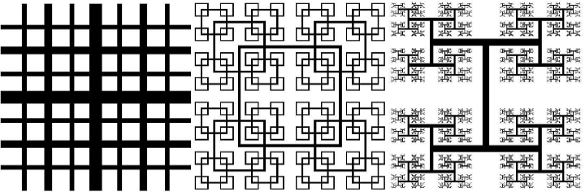
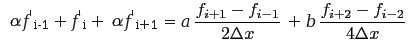
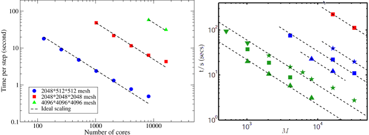
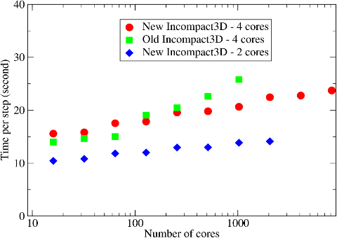
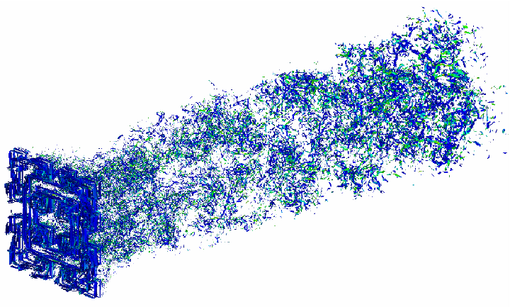

# Incompact3D - a CFD Code for Direct Numerical Simulations

Incompact3D is now an open-source project. It is available at https://github.com/xcompact3d/Incompact3d

This page concerns the development of a unique CFD application Incompact3D for direct and large-eddy simulations of turbulent flows. This code was first developped at the [Turbulence, Mixing and Flow Control group](http://www.imperial.ac.uk/tmfc) at Imperial College London. The group was working on cutting-edge energy problems. One example of their work was a new flow concept concerning turbulence generated by multi-scale/fractal objects (as shown in Fig. 1). This class of new flow concepts was offering possibilities for brand-new flow solutions useful in industrial mixers, silent air-brakes, new ventilation and combustion devices. Many wind tunnel measurements were performed successfully at Imperial College[1][2]. To complement these experimental results, high-resolution simulations of such multi-scale flows were required in order to understand the underlying physics. And in order to resolve the turbulent eddies associated with the smallest scale, very large simulations, often with billions of mesh points, were required.

   
  Figure 1: Three types of fractal grid.

Incompact3D solves the governing equations of fluid problems in incompressible form. When parallelising such applications, there are often two areas requiring major development efforts: the spatial discretisation and approximation of the the Navier-Stokes equations; and the solving of the pressure Poisson's equation to enforce mass conservation. The complete coverage of Incompact3D's algorithms is published by Laizet & Lamballais[3]. Here only key areas that are relevant to code parallelisation are highlighted.

#### Compact Finite Difference Scheme

Incompact3D uses a 6th order compact finite difference scheme to discretise the convective and diffusive terms of Navier-Stokes equations on a Cartesian mesh. The operators for evaluating spatial derivatives and doing spatial interpolations take an implicit form. For example, the first derivative on a collocated mesh can be calculated using:

   

As can be seen, this formulation results in solving a tridiagonal system along each global mesh line in all three spatial dimensions. In the parallel implementation, the tridiagonal systems are solved using the original serial solver with the data distributed on to local memory using the global transposition routines supplied by the decomposition API of 2DECOMP&FFT.

#### Pressure Poisson's Equations

There are various numerical algorithms solving the pressure Poisson's equations, broadly classified into two categories: iterative solvers and direct solvers. The Multigrid approach is often considered most efficient iterative method while FFT-based solvers are the most efficient direct methods.

There are actually two types of FFT-based approaches to solve Poisson's equations. The first type, sometimes referred to as matrix decomposition, uses Fourier's method to treat the finite difference discretisation of Poisson's equations. Using ordinary central differencing, a finite difference discretisation of a 3D Poisson's equation results in a linear system with seven diagonal lines. To solve the system quickly, one can apply Fourier analysis in one dimension, reducing the system to a number of pentadiagonal systems. Fourier analysis in a second dimension further reduces the problem to many tridiagonal systems which can be solved efficiently. The mathematical formulations of such method, in particular the proper treatment of non-periodic boundary conditions and the applications on different mesh configurations (staggered vs. collocated mesh), were established in 1970's[4][5] and a serial implementation is available in the form of open-source software [FISHPACK](http://www.netlib.org/fishpack). This method actually fits in the 2DECOMP&FFT framework very well - one can apply 1D FFTs and a tridiagonal solver direction by direction in local memory, given that the data involved is properly redistributed using the transposition routines.

The originality of Incompact3D's numerical algorithm comes from its Poisson solver of a second type - it is solved in the spectral space via the modified wave number formalism and it applies no matter what physical boundary conditions are (periodic, free-slip, no-slip, inflow/outflow). The solver takes advantage of the 3D distributed FFT supplied by 2DECOMP&FFT. The algorithm involves the following steps:

- Pre-processing in physical space
- 3D forward FFT
- Pre-processing in spectral space
- Solving the Poisson's equation by division of modified wave numbers
- Post-processing in spectral space
- 3D inverse FFT
- Post-processing in physical space

The forward and backward transforms above are standard FFTs (even for problems with non-periodic boundary conditions). Depending on different boundary conditions, some of the pre- or post-processing steps may be required. Without giving any mathematical details, the pre- and post-processing involves operations which evaluate modified wave numbers and package the Discrete Cosine Transforms into a suitable form so that standard FFT routines can be applied.

The pre- and post-processing can be either local - meaning that operations can be applied regardless of the parallel distribution of data, or global - meaning that calculations are only possible when datasets involved are all local in memory (i.e. the operations have to be done in a particular pencil-orientation). Fortunately, for the global case, whenever the data required is not available, the global transposition routines provided by the base library can be used to redistribute the data. A pair of forward and backward FFTs with 2D decomposition requires 4 global transpositions. Depending on the physical boundary conditions, the pre- and post-processing above may add up to 12 more global transpositions in Incompact3D.

#### Parallel Performance

The old Incompact3D was parallelised using a 1D slab decomposition. This seriously limited its applications to large-scale simulations. For example, a typical simulation using a 2048*512*512 mesh could only use up to 512 cores. On HECToR, this roughly translated to a runtime of 25 days (wall-clock time) or 50 12-hour sessions, excluding queueing time. Obviously at this rate it was impossible to conduct productive scientific studies.

The new Incompact3D was completely rewritten using the 2DECOMP&FFT library, making it scalable to tens of thousands of cores. To examine the performance of the new Incompact3D, several simulations were set up on meshes up to 4096^3 points and ran on HECToR using up to 16384 cores. The results are shown in Fig. 2.

   
  Figure 2: Strong scaling. Left: Incompact3D using 2DECOMP&FFT; Right: Spectral DNS code by P. K. Yeung using P3DFFT, as a reference.

It can be seen that the new code scales extremely well on HECToR. In comparison, the scaling results of P. K. Yeung's spectral DNS code[6] based on P3DFFT library are reproduced here. What is directly comparable is the data set taken from supercomputer Franklin (was also a Cray XT4) shown as green triangles, exhibiting very similar scaling behaviour.

Fig. 3 shows the weak scaling of Incompact3D at a workload of 4191304 mesh points per MPI rank. A performance comparison between the old and the new code on HECToR phase 2a hardware is given. The old Incompact3D, implemented using a 1D slab decomposition, was faster on smaller core counts. But the new Incompact3D outperformed the old code for larger cases (theoretically the 1D decomposition code should be faster across the scale, but additional optimisations to the computational part of the code were also introduced). More importantly, the new code could scale to ten of thousands of cores. The 25-day job mentioned earlier could now be completed within 2 days using 4096 cores. This improve the group's productivity significantly.

   
  Figure 3: Weak scaling of Incompact3D.

Fig. 3 also shows that when using only 2 cores per quad-core node, the code was consistently 30% faster due to improved memory and network bandwidth. This suggests that introducing another level of parallelism at node level, possibly through the use of OpenMP for the computational part of the job, may further improve the code performance.

More performance results of Incompact3D are reported by Laizet & Li[7]. And finally, some scientific results are given in Fig. 4 showing the simulated vorticity field downstream of a square-shaped fractal grid in a wind tunnel. Comparing to the conventional grid, the fractal grid can generate more turbulence while introducing smaller pressure drop to the flow - a more energy efficient configuration that may be explored in applications such as combustion devices. More scientific results are reported by Laizet & Vassilicos[8].

   
  Figure 4: Vorticity field of flow downstream of a fractal square grid.

#### References

[1] D. Hurst and J.C. Vassilicos, "Scalings and decay of fractal-generated turbulence", *Physics of Fluids*, vol. 19(3), 2007.

[2] R.E. Seoud and J.C. Vassilicos, "Dissipation and decay of fractal-generated turbulence", *Physics of Fluids*, vol. 19(10), 2007.

[3] S. Laizet and E. Lamballais, "High-order compact schemes for incompressible flows: A simple and efficient method with quasi-spectral accuracy", *Journal of Computational Physics*, vol. 228(16):5989-6015, 2009.

[4] P.N. Swarztrauber, "The methods of cyclic reduction, fourier analysis and the FACR algorithm for the discrete solution of Poisson's equation on a rectangle", *SIAM Review*, vol. 19(3):490-501, 1977.

[5] R.B. Wilhelmson and J.H. Erickson, "Direct solutions for Poisson's equation in three dimensions", *Journal of Computational Physics*, vol. 25(4):319-331, 1977.

[6] D. A. Donzis, P. K. Yeung, and D. Pekurovsky, "Turbulence simulation on o(104) processors", In *TeraGrid'08*, 2008.

[7] S. Laizet and N. Li, "Incompact3d: a powerful tool to tackle turbulence problems with up to o(105) computational cores", *International Journal for Numerical Methods in Fluids*, vol. 67(11):1735-1757, 2011.

[8] S. Laizet and J.C. Vassilicos, "DNS of Fractal-Generated Turbulence", *Flow, Turbulence and Combustion*, vol. 87(4):673-705, 2011.