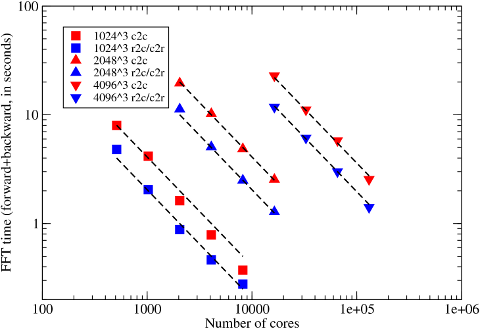

## Benchmarks on JUGENE

This set of benchmarked was performed in May 2010 on JUGENE, the big IBM Blue Gene/P system at Jülich Supercomputing Centre in Germany. The system ranked world No. 4 by that time, with a Linpack capability of 825.5 TFLOPs.

The work was made possible with the assistance of high performance computing resources (Tier-0) provided by PRACE. 2DECOMP&FFT was ported onto the Blue Gene/P. One major improvement achieved was the implementation of the FFT interface using ESSL, a high-performance math library native to IBM systems. The FFT interface was then benchmarked on problem sizes up to 8192^3 using up to 131072 cores.

   
  Scaling of the FFT interface on Blue Gene/P JUGENE.

As seen, the code scales extremely well on the system for all problem sizes. The apparent super-linear scaling for the 1024^3 case is understood to be related to the Torus network configurations that favour larger jobs.
