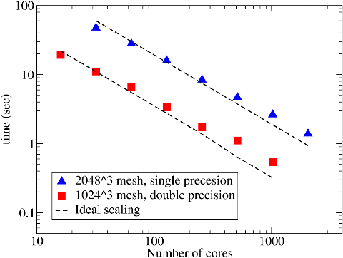
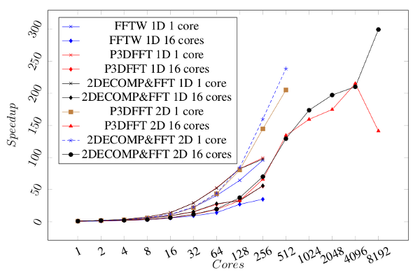

## 2DECOMP&FFT vs. P3DFFT

P3DFFT is probably the most well-known open-source distributed FFT library. The project was initiated at San Diego Supercomputer Center at UCSD by Dmitry Pekurovsky. It is highly efficient and it has been widely adopted by scientists doing large-scale simulations, such as high-resolution turbulence simulations.

P3DFFT was actually ported onto HECToR (my development system) at the early stage of the 2DECOMP&FFT project. Fig. 1 shows its good scaling on the old hardware (back in early 2009, the system was a Cray XT4 using dual-core AMD Opteron processors and Cray SeaStar interconnect).

   
  Figure 1. P3DFFT scaling on Cray XT4 HECToR.

What motivated the author to develop a new and somewhat competing library were the following:
- P3DFFT is an FFT-only package. It is not designed as a general-purpose 2D decomposition library and its communication routines are not designed to be user callable. 2DECOMP&FFT provides a general-purpose decomposition library to support the building of a variety of applications (the applications do not necessarily need to use FFT).
- P3DFFT appears to be targeting applications using spectral method and only performs real-to-complex and complex-to-real transforms. 2DECOMP&FFT is also able to support complex-to-complex transforms. **Note that the new generation of P3DFFT library (dubbed P3DFFT++ or P3DFFT v.3) is a generalization of the concept of P3DFFT and does support complex-to-complex transforms.**
- The separation of communication layer and the FFT layer in 2DECOMP&FFT makes it possible to build additional libraries (such as transforms using Chebyshev or Jacobian basis functions, or a general-purpose PDE solver). It is also easier to implement advanced software features (such as the shared-memory implementation) where only the low-level communication code needs to be updated.

#### Performance Comparison

The parallel performance of 2DECOMP&FFT and P3DFFT has been studied in great detail in a [MSc thesis by E. Brachos at University of Edinburgh](https://static.epcc.ed.ac.uk/dissertations/hpc-msc/2010-2011/EvangelosBrachos.pdf). Fig. 2 shows a set of benchmark on r2c/c2r transforms of size 256^3. The MPI interface of FFTW 3.3 was also examined, although it can only run in 1D slab decomposition mode.

   
  Figure 2. Speedup of 2DECOMP&FFT, P3DFFT and FFTW 3.3's MPI interface.

The performance difference between 2DECOMP&FFT and P3DFFT is often shown to be marginal, although the best 2D processor grid to achieve the optimal performance can be very different due to the different internal architecture of the two libraries.

The scalability and the absolute performance of both 2DECOMP&FFT and P3DFFT are better than FFTW 3.3 running in MPI mode. FFTW is, however, much more efficient in OpenMP mode. This suggests that a hybrid implementation may be the future direction of 2DECOMP&FFT.