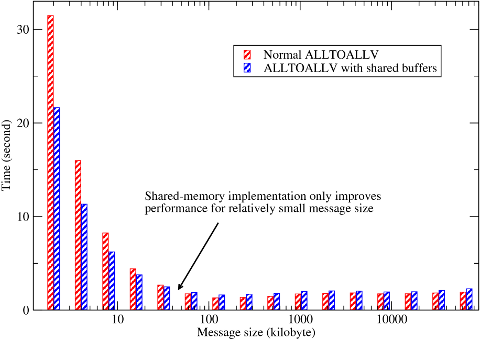
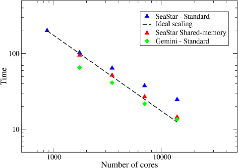

## Shared-memory Programming using System V IPC

Most modern supercomputers are equipped with multi-core processors and cores on same node often share local memory. There are various programming models which can take advantage of this architecture, including the popular hybrid MPI/OpenMP model. In the context of this project, shared-memory programming is used to improve the efficiency of the communication code. 

For all-to-all type of communication in which each MPI rank has to send/receive messages to/from all other MPI ranks, traffics from cores on the same physical node compete for their network interface. Even if the network bandwidth is sufficient, the performance is likely to be affected by network latency when too many small messages are passed within the system. One solution is to create shared send/recv buffers on each SMP node. Then only leaders of the nodes participate MPI_ALLTOALL(V), resulting in fewer but larger messages, hopefully improving the communication performance. The interconnects of supercomputers are often optimised for handling small amount of large messages. 

This feature has been implemented within the communication library as a black box. It can be activated by users at compile time by using '-DSHM' flag. The shared-memory code uses the System V Inter-Process Communication (IPC) API which is widely supported on many variants of UNIX. 

2DECOMP&FFT has two independent shared-memory implementations (they validate each other):

- The first version is based on code supplied by David Tanqueray of Cray Inc., who initially applied this idea to several molecular dynamics applications. This code accesses platform-dependent information<a href="#note1" id="note1ref">1</a> in order to establish the share-memory configurations (such as which MPI rank belongs to which node). It has been tested on Cray hardware only.
-  The second version is based on the open-source package FreeIPC, created by Ian Bush, a former NAG colleague. FreeIPC is basically a Fortran wrapper for the System V IPC API and it provides a system-independent way to gather shared-memory information. This makes it possible to write more portable shared-memory code. 

Fig. 1 below demonstrates the typical benefit of shared-memory programming. The data was collected on HECToR phase 2a system (Cray XT4 with quad-core AMD Opteron processors) from a series of simulations using 256 MPI ranks over a range of problem sizes. When the problem size is small (so is the message size), the communication routines were called more times so that the total amount of data moving within the system remains a constant. It can be seen that when the problem size is smaller, the overhead of setting up communications is much higher and the shared-memory code can improve communication efficiency by up to 30%. As the problem size increases, the benefit of using shared-memory code becomes smaller. For large message size (> 32Kb in this example), the shared-memory code is actually slower due to the extra memory copying operations required to assemble/disassemble the shared-memory buffers. 

   
  Figure 1: Typical shared-memory code performance. 
  

The HECToR upgrade to phase 2b (world's first production Cray XE6) presented a unique opportunity to demonstrate the benefit of shared-memory programming in real applications. The 24-core nodes were introduced to HECToR several months before the arrival of new Gemini interconnect. During the transitional period, communication intensive applications often produced more network traffic than the old SeaStar interconnect could handle. Fig.2 shows the benchmark of 2DECOMP&FFT's FFT interface with a 2592^3 problem size<a href="#note2" id="note2ref">2</a>. With the slow SeaStar interconnect, the scaling was poor when using more than few thousands cores. However, switching on the shared-memory code significantly improved the application performance (by as far as 40%) and parallel efficiency of more than 90% was observed through out the scale. The new Gemini interconnect offered significant improvement in terms of both network bandwidth and latency. As a result, significant performance gain was to be expected for communication intensive codes. The FFT benchmark was almost twice as fast in some cases. However, the shared-memory code on Gemini (not shown in the figure) offered absolutely no benefit when the network was fast enough to handle all the messages efficiently. 

   
  Figure 2: Parallel FFT performance: SeaStar (with and without shared-memory) vs. Gemini. 
  

---

<a id="note1" href="#note1ref">1</a>On Cray XT/XE systems, this is done by checking the /proc file system of the computing nodes. 

<a id="note2" href="#note2ref">2</a>The problem size of 2592 was chosen intentionally because it is divisible by 6 multiple times, which helped achieve better load balance on the system using 24-core node (containing two Magny-Cours processors, each with two six-core dies).